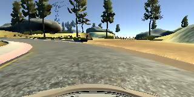
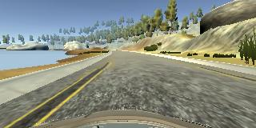
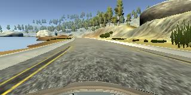
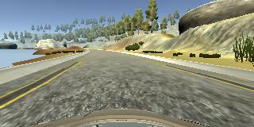
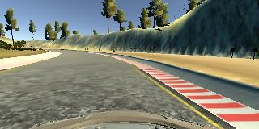
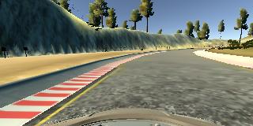
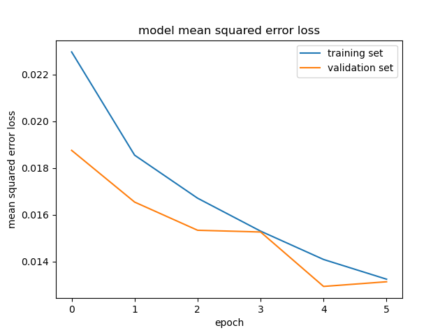

# **Behavioral Cloning** 

**Behavioral Cloning Project**

The goals / steps of this project are the following:
* Use the simulator to collect data of good driving behavior
* Build, a convolution neural network in Keras that predicts steering angles from images
* Train and validate the model with a training and validation set
* Test that the model successfully drives around track one without leaving the road
* Record a video of the successful drive
* Summarize the results with a written report

## Rubric Points
Here I consider the [rubric points](https://review.udacity.com/#!/rubrics/432/view) individually and describe how I addressed each point in my implementation.  
### Files Submitted & Code Quality

#### 1. Submission includes all required files and can be used to run the simulator in autonomous mode

My project includes the following files:
* model.py - containing the script to create and train the model
* drive.py - for driving the car in autonomous mode
* model.h5 - containing a trained convolution neural network 
* this report.md - summarizing the results
* video.mp4 - recording of the autonomous mode of the vehicle

#### 2. Submission includes functional code
Using the Udacity provided simulator and drive.py file, the car can be driven autonomously around the track by executing 
```sh
source activate carnd-term1
python drive.py model.h5
```

#### 3. Submission code is usable and readable

The model.py file contains the code for training and saving the convolution neural network. The file shows the pipeline I used for training and validating the model, and it contains comments to explain how the code works.

### Model Architecture

#### Design Approach

The overall strategy for deriving a model architecture was to chop out the irrelevant part of the environment and squeeze out the most out of the images by applying 5 convolutional layers with different filter kernels and paddings, followed by 4 fully-connected layers, resulting in  1 output neuron.

I've got inspired by the CNN architecture, designed by [Nvidia](https://devblogs.nvidia.com/deep-learning-self-driving-cars/) .

Here is a visualization of the Nvidia's architecture:


In order to gauge how well the model was working, I split my image and steering angle data into a training (80%) and validation (20%) set (model.py lines 126). Besides, I shuffle the data before every training (model.py line 92).

I found that my first model had a low mean squared error on the training set but a high mean squared error on the validation set. This implied that the model was overfitting. 

To combat the overfitting, I did two things:

* Added two Dropout layers with 20% dropout rate. One layer detween 3rd and 4th convolutional layers and the second one between 2nd and 3rd fully-connected layers.

- I have set the number of epochs to 6, in order to strengthen the learning rate of the model with reduced amount of nodes due to dropout layer.

#### Model Architecture in Detail

The final model architecture (model.py lines 94-129) consist of preprocessing, data processing, training and saving the model.

##### Preprocessing

1. Images are shuffled.
2. Images are normalized in the model using a Keras lambda layer (model.py line 89) 
3. Top and bottom of the images are chopped to remove noise of the environment (top) and a front of a car (bottom)

##### CNN Architecture

The structure of my model is as follows:

1.  Three convolutional layers with ReLU activation function, 5x5 filter sizes and depths between 24 and 48 (model.py lines 99-101) .
2.  Dropout layer to teach the model handle inconsistent data (model.py line 104) .
3.  Two convolutional layers with ReLU activation function, 3x3 filter sizes and depth of 64 (model.py lines 107-108) 
4.  Flatting layer.
5.  Two fully-connected layers with tanh activation function to introduce additional nonlinearity between neurons (model.py lines116-117).
6.  Dropout layer to teach the model handle inconsistent data (model.py line 104) .
7.  Final two fully-connected layers resulting in 1 output node.

#### Model parameter tuning

The model used an adam optimizer, so the learning rate was not tuned manually (model.py line 126).

### Training Strategy

#### Training Data

Training data was chosen to keep the vehicle driving on the road. I used a combination of:

*  perfect_line: center lane driving

* recovery_left: recovering from the left side of the road. 

* recovery_right: recovering from the right side of the road.

  Since images occupy roughly 700Mb of space, they are not uploaded. Let me know if you need them.

To capture good driving behavior, I first recorded two laps on track one using center lane driving. Here is an example image of center lane driving:



I then recorded the vehicle recovering from the left side and right sides of the road back to center so that the vehicle would learn how to get back to the perfect line without knowing on how to get off the perfect line. These images show what a recovery looks like:







To augment the data set, I also flipped images and angles thinking that this would ... For example, here is an image that has then been flipped:





After the collection process, I had 17682 number of data points. In total, including center, left and right camera images and flipping all of those, the model had bee trained with 84874 images and validated with 21218 images.

#### Training Process

I used this training data for training the model. The validation set helped determine if the model was over or under fitting. The ideal number of epochs was 6 as evidenced by validation loss after every epoch run, shown in the graph below:



I used an adam optimizer so that manually training the learning rate wasn't necessary.